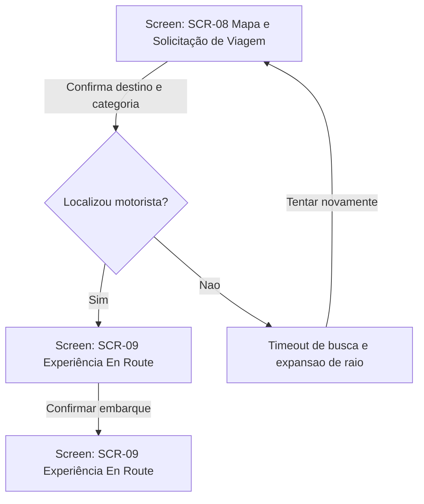
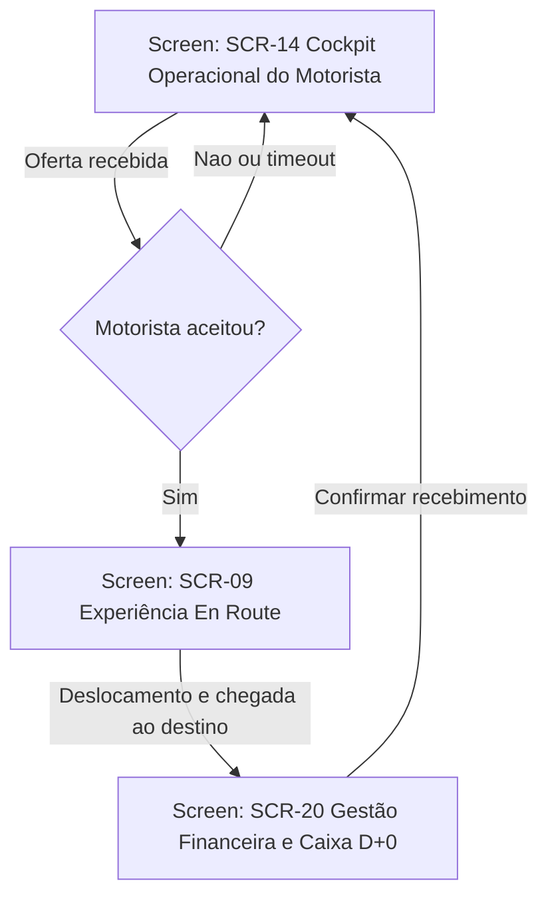
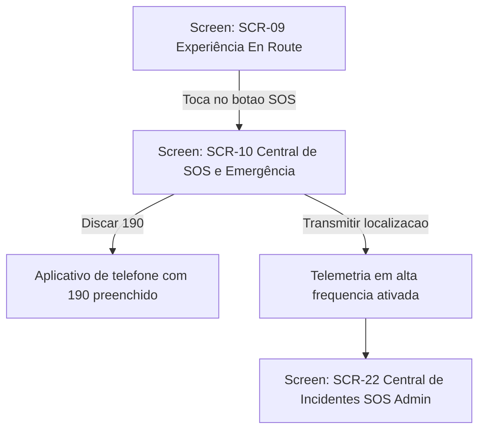
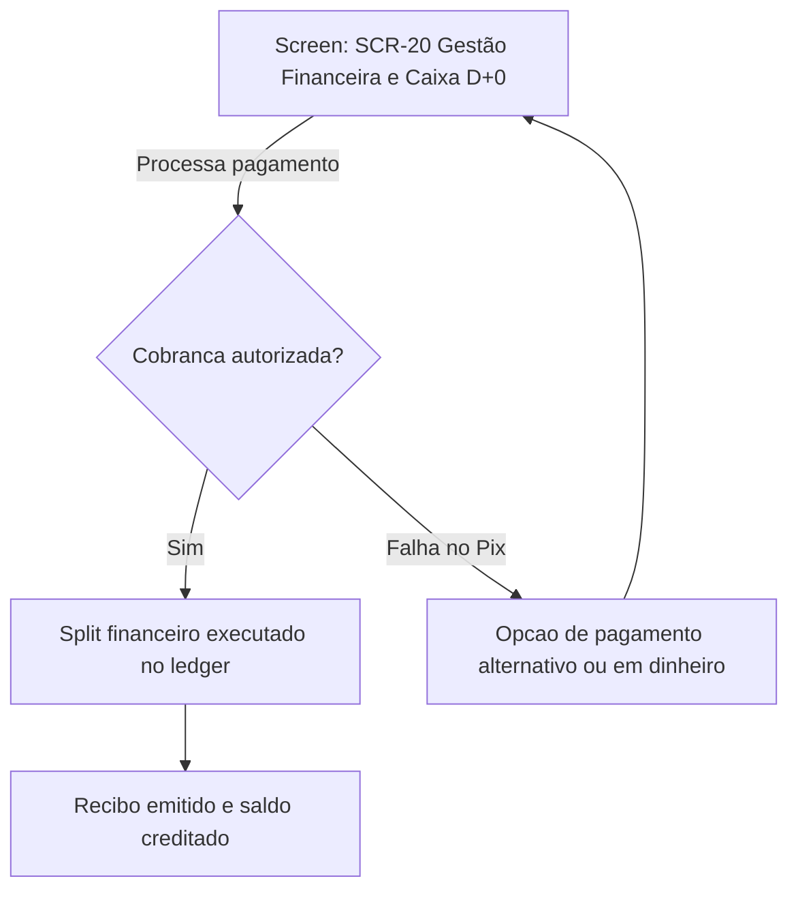
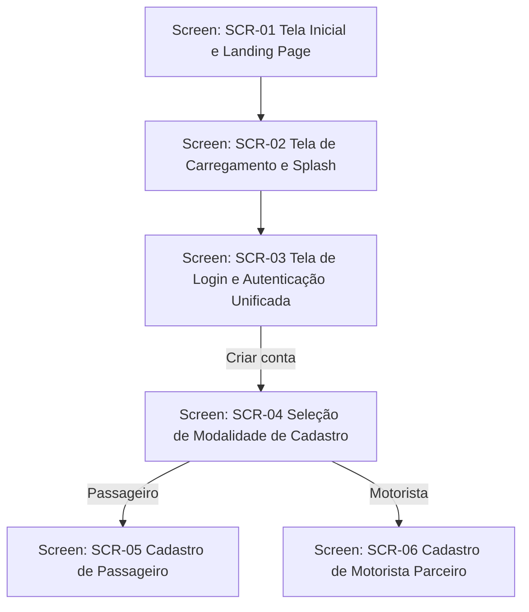
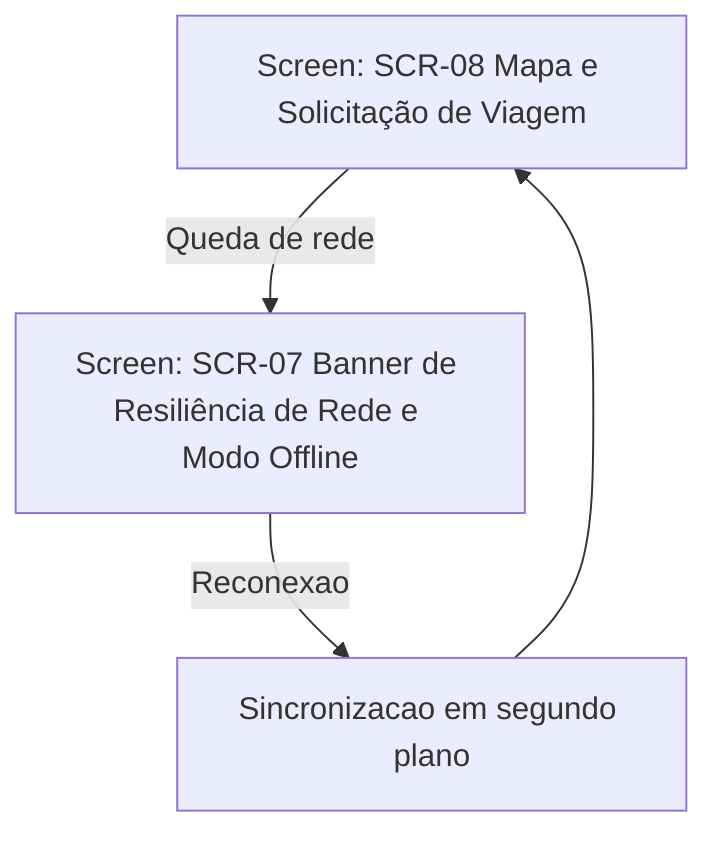
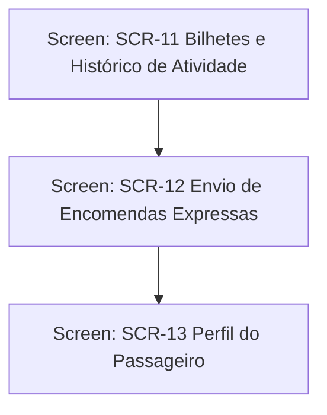
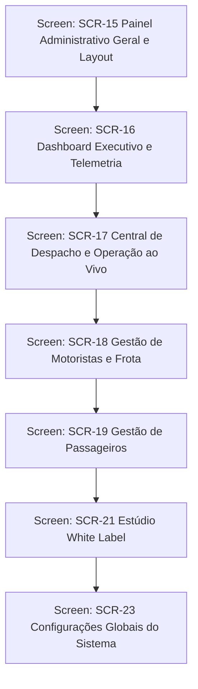

# User Flows

<!-- Managed with super-ux (ux-contract v4). The HOW layer: task analysis
and user flows. Flows reference screens by SCR-ID (full specs live in
screens.md). Scenarios in scenarios.md trace to FLW-IDs and must cover every
node and edge. -->

### FLW-01: Solicitação e Embarque da Corrida
- **Traces:** ST-001 (JTBD-01, JRN-01/#1)
- **Goal:** Passageiro solicita categoria com preço garantido, localiza motorista parceiro próximo e realiza o embarque
- **Entry points:** Tela inicial do passageiro
- **Success exit:** Tela de acompanhamento de viagem em andamento
- **Task analysis:**
  1. Passageiro informa o destino desejado e confirma o ponto de embarque no mapa
  2. Sistema calcula trajeto, tempo estimado de chegada e valor fixo para cada categoria disponível
  3. Passageiro seleciona a categoria e clica em confirmar solicitação
  4. Motor de despacho localiza motoristas em ondas sucessivas de raio de proximidade
  5. Condutor aceita a viagem e o mapa passa a exibir a aproximação em tempo real
  6. Passageiro embarca no veículo e a corrida tem início
- **Flow:**

- **Screens traversed:**
  | Screen | States used here |
  |--------|------------------|
  | SCR-08 Mapa e Solicitação de Viagem | success, loading, error |
  | SCR-09 Experiência En Route | success |
  | SCR-14 Cockpit Operacional do Motorista | success |

### FLW-02: Cumprimento e Finalização de Corrida pelo Motorista
- **Traces:** ST-002 (JTBD-02, JRN-02/#2)
- **Goal:** Motorista aceita chamada no cockpit, cumpre o trajeto com navegação fluida e conclui a corrida
- **Entry points:** Cockpit operacional do motorista
- **Success exit:** Tela de recibo com ganho líquido somado e cockpit disponível para novas chamadas
- **Task analysis:**
  1. Motorista recebe card de oferta com detalhes de rota, distância até embarque e valor líquido
  2. Motorista aceita a corrida dentro da contagem regressiva de 15 segundos
  3. Navegação por GPS com interpolação projeta o trajeto até o passageiro
  4. Motorista confirma o embarque e inicia o deslocamento até o destino
  5. Ao chegar ao destino, motorista clica em finalizar corrida
- **Flow:**

- **Screens traversed:**
  | Screen | States used here |
  |--------|------------------|
  | SCR-09 Experiência En Route | success |
  | SCR-14 Cockpit Operacional do Motorista | success, error |
  | SCR-20 Gestão Financeira e Caixa D+0 | success |

### FLW-03: Gestão de Emergência e Acionamento de SOS
- **Traces:** ST-003 (JTBD-01, JRN-01/#4)
- **Goal:** Usuário em situação de perigo dispara o protocolo de segurança operacional e chamada para 190
- **Entry points:** Botão SOS em destaque permanente na tela de viagem
- **Success exit:** Alerta transmitido para a central de monitoramento com rota ao vivo e discador policial aberto
- **Task analysis:**
  1. Usuário toca no botão vermelho SOS de emergência
  2. Modal de confirmação ágil oferece opção de chamada 190 e compartilhamento de rota em link seguro
  3. Sistema eleva a frequência de telemetria GPS para streaming em tempo real
- **Flow:**

- **Screens traversed:**
  | Screen | States used here |
  |--------|------------------|
  | SCR-09 Experiência En Route | success |
  | SCR-10 Central de SOS e Emergência | success, error |
  | SCR-22 Central de Incidentes SOS Admin | success |

### FLW-04: Liquidação Financeira Instantânea com Split Pix
- **Traces:** ST-004 (JTBD-02, JRN-02/#5)
- **Goal:** Cobrança debitada e valor líquido transferido com liquidação imediata e registro contábil de partidas dobradas
- **Entry points:** Finalização da corrida pelo condutor
- **Success exit:** Saldo liberado no extrato do motorista com comprovante detalhado
- **Task analysis:**
  1. Encerramento da corrida dispara requisição idempotente de faturamento
  2. Gateway de pagamento processa liquidação via Pix
  3. Ledger contábil executa split entre franquia e condutor
  4. Extrato é atualizado em tempo real na interface
- **Flow:**

- **Screens traversed:**
  | Screen | States used here |
  |--------|------------------|
  | SCR-14 Cockpit Operacional do Motorista | success |
  | SCR-20 Gestão Financeira e Caixa D+0 | success, error |

### FLW-05: Onboarding e Autenticação Unificada
- **Traces:** ST-005 (JTBD-01, JRN-01/#1)
- **Goal:** Apresentar a plataforma, permitir seleção entre passageiro e motorista e concluir o cadastro
- **Entry points:** Landing page pública ou splash inicial
- **Success exit:** Redirecionamento autenticado para o mapa do passageiro ou cockpit do motorista
- **Task analysis:**
  1. Usuário acessa a página inicial ou abre o app pela primeira vez
  2. Visualiza a splash e tela inicial de apresentação da marca
  3. Toca em Entrar ou Criar Conta e seleciona seu perfil
  4. Preenche credenciais e valida telefone
- **Flow:**

- **Screens traversed:**
  | Screen | States used here |
  |--------|------------------|
  | SCR-01 Tela Inicial e Landing Page | success |
  | SCR-02 Tela de Carregamento e Splash | success, loading |
  | SCR-03 Tela de Login e Autenticação Unificada | success, error, loading |
  | SCR-04 Seleção de Modalidade de Cadastro | success |
  | SCR-05 Cadastro de Passageiro | success, error |
  | SCR-06 Cadastro de Motorista Parceiro | success, error |

### FLW-06: Resiliência Offline e Sincronização de Rede
- **Traces:** ST-006 (JTBD-01, JRN-01/#3)
- **Goal:** Proteger o estado da corrida durante quedas transitórias de conectividade
- **Entry points:** Oscilação de dados móveis em segundo plano
- **Success exit:** Banner de reconexão bem-sucedida e retomada contínua do mapa
- **Task analysis:**
  1. Conexão física de rede cai durante busca ou corrida ativa
  2. Banner não-intrusivo informa reconexão sem bloquear controles principais
  3. Conexão retorna e fila de eventos sincroniza no Supabase
- **Flow:**

- **Screens traversed:**
  | Screen | States used here |
  |--------|------------------|
  | SCR-07 Banner de Resiliência de Rede e Modo Offline | success, error |
  | SCR-08 Mapa e Solicitação de Viagem | success |
  | SCR-14 Cockpit Operacional do Motorista | success |

### FLW-07: Consulta de Histórico e Encomendas
- **Traces:** ST-007 (JTBD-01, JRN-01/#5)
- **Goal:** Permitir ao usuário consultar corridas anteriores, gerenciar perfil e solicitar entregas
- **Entry points:** Menu inferior do passageiro
- **Success exit:** Comprovante exibido ou entrega despachada
- **Task analysis:**
  1. Usuário toca na aba Atividade ou Encomendas
  2. Consulta comprovantes ou preenche dados do pacote
  3. Atualiza dados e foto no perfil
- **Flow:**

- **Screens traversed:**
  | Screen | States used here |
  |--------|------------------|
  | SCR-11 Bilhetes e Histórico de Atividade | success, empty, error |
  | SCR-12 Envio de Encomendas Expressas | success, error |
  | SCR-13 Perfil do Passageiro | success, error |

### FLW-08: Governança e Painel Administrativo
- **Traces:** ST-008 (JTBD-03, JRN-01/#2)
- **Goal:** Fornecer ao gestor visão global de telemetria, aprovação de condutores e personalização
- **Entry points:** Rota administrativa restrita (/app/admin)
- **Success exit:** Decisão executiva aplicada e sincronizada no cluster
- **Task analysis:**
  1. Administrador faz login no painel de comando
  2. Audita frotas no mapa e analisa solicitações de credenciamento
  3. Ajusta cores e parâmetros no White Label Studio
- **Flow:**

- **Screens traversed:**
  | Screen | States used here |
  |--------|------------------|
  | SCR-15 Painel Administrativo Geral e Layout | success |
  | SCR-16 Dashboard Executivo e Telemetria | success |
  | SCR-17 Central de Despacho e Operação ao Vivo | success |
  | SCR-18 Gestão de Motoristas e Frota | success |
  | SCR-19 Gestão de Passageiros | success |
  | SCR-21 Estúdio White Label | success |
  | SCR-23 Configurações Globais do Sistema | success |
