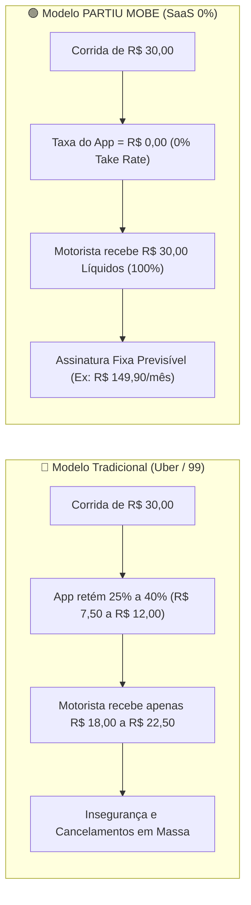

# 01. Visão Geral e Ecossistema PARTIU MOBE

---

## 1. Introdução e Filosofia de Produto

O **PARTIU MOBE** é uma plataforma brasileira de mobilidade urbana inteligente e logística urbana sob demanda criada para redefinir as relações de trabalho e sustentabilidade econômica no setor de transporte por aplicativo.

### O Problema do Modelo Tradicional (Big Techs)
Plataformas hegemônicas como Uber e 99 cobram comissões predatórias dos motoristas (variando entre **20% e 42%** do valor de cada viagem). Esse modelo gera:
- **Descontentamento e Burnout dos Motoristas:** Condutores trabalham 12 a 16 horas diárias para cobrir custos de combustível e manutenção após o confisco de taxas.
- **Cancelamentos Frequentes:** Motoristas recusam corridas curtas ou com tarifas dinâmicas baixas devido à margem comprimida.
- **Insegurança Econômica:** Motoristas nunca sabem quanto realmente ganharão no final do mês devido a flutuações algorítmicas opacas de comissão.

### A Solução PARTIU MOBE: Modelo SaaS Puro (Taxa Zero 0%)
O PARTIU inverte a lógica de intermediação:
- **0% de Comissão por Corrida:** 100% do valor pago pelo passageiro é repassado integralmente ao motorista no exato momento da conclusão da viagem (D+0).
- **Assinatura Fixa do Motorista:** O motorista paga uma taxa fixa periódica (mensalidade, assinatura semanal ou passe diário) pelo direito de usar a infraestrutura tecnológica do aplicativo.
- **Relação Transparente:** O motorista sabe exatamente o seu custo operacional fixo da plataforma (ex: R$ 149,90/mês). Qualquer valor faturado além desse valor pertence 100% a ele.

---

## 2. Diferenciais Competitivos Estruturais

| Dimensão | Modelo Big Tech (Uber / 99) | PARTIU MOBE (SaaS Puro) |
| :--- | :--- | :--- |
| **Comissão por Viagem** | 20% a 42% descontados de cada corrida | **0,0% (Taxa Zero)** |
| **Receita do Motorista** | Variável, opaca e dependente de algoritmo | **100% previsível e líquida D+0** |
| **Monetização da Plataforma** | Confisco fracionado de corridas | **Mensalidades / Assinaturas periódicas** |
| **Taxa de Aceite de Viagens** | Baixa (muitas recusas por taxa predatória) | **Alta (motorista lucra com cada km rodado)** |
| **Relacionamento Local** | Distante, suporte automatizado e impessoal | **Franquias e cooperativas locais com atendimento humano** |
| **Expansão e Regionalização** | Centralizada e monolítica | **Modelo White-Label com soberania municipal** |

---

## 3. Atores do Ecossistema

O ecossistema PARTIU é composto por quatro papéis principais com responsabilidades e interfaces bem definidas:

### 1. Passageiro (Cliente Final)
- **Interface:** Web App Mobile / PWA instalável com geolocalização e mapas em tempo real.
- **Objetivo:** Solicitar corridas urbanas ou envios de encomendas com rapidez, segurança e tarifas justas.
- **Pagamento:** Paga o valor integral da corrida diretamente ao motorista (dinheiro físico, chave Pix do condutor ou maquininha de cartão no carro).
- **Recursos:** Estimativa prévia de trajeto e preço, mapa ao vivo com rastreamento do condutor, botão de emergência SOS, avaliação bilateral e suporte operacional.

### 2. Motorista Parceiro (Condutor / Operador da Frota)
- **Interface:** Web App Mobile / PWA otimizado com modo escuro/claro, botões de alta ergonomia e comandos por voz.
- **Objetivo:** Realizar viagens e entregas retendo 100% dos rendimentos líquidos.
- **Assinatura:** Mantém plano de acesso ativo (Diário, Semanal, Mensal ou Anual). Efetua pagamento via Pix dinâmico com ativação instantânea em segundos.
- **Recursos:** Toggle "Ficar Online" inteligente (com validação em tempo real de documentos e assinatura), radar de ofertas com alerta sonoro e contagem regressiva, painel de ganhos detalhado sem descontos, navegação assistida e central de emergência SOS.

### 3. Franqueado / Operador Regional (White-Label)
- **Interface:** Painel Web Administrativo Regional com governança de praça.
- **Objetivo:** Operar a marca PARTIU (ou marca própria licenciada via White-Label) em sua cidade ou região metropolitana.
- **Monetização:** Recebe percentual recorrente de royalties sobre as assinaturas pagas pelos motoristas cadastrados em sua praça.
- **Recursos:** Wizard de onboarding da cidade, parametrização de tarifas base locais, aprovação documental de condutores da região, visualização de calor de demanda (H3 Heatmaps) e suporte aos motoristas locais.

### 4. Super Administrador (Diretoria Executiva da Plataforma)
- **Interface:** Painel Web Administrativo Central (Nacional / Master).
- **Objetivo:** Gestão global de escalabilidade, saúde financeira da holding, tecnologia e segurança.
- **Métricas:** Dashboard executivo com MRR, ARR, LTV, CAC, Taxa de Churn de assinantes e GMV total transacionado na plataforma.
- **Recursos:** Catálogo global de planos de assinatura, auditoria contábil FinOps (Ledger de dupla entrada), monitoramento de infraestrutura em tempo real, gestão de gateways Pix e modo avançado com proteção biométrica/confirmação explícita.

---

## 4. Governança Multi-Tenant e Soberania Regional

O PARTIU foi arquitetado como uma plataforma **Multi-Tenant Nativa**:
1. **Isolamento Lógico:** Cada praça ou franqueado opera sob um `tenant_id` específico, garantindo que condutores, frotas e dados financeiros de uma cidade não se misturem aos de outra praça.
2. **Políticas de RLS (Row Level Security):** O banco de dados PostgreSQL bloqueia categoricamente acessos cruzados entre franquias no nível de kernel SQL.
3. **Customização Visual (White-Label Studio):** Cada operador pode definir nome do aplicativo, logotipo, paleta de cores primárias, domínio próprio e termos de uso municipais sem alterar uma única linha do código-fonte central.
