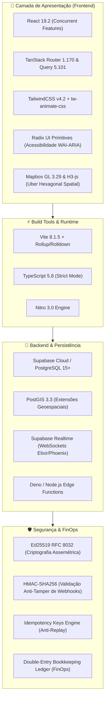

# 02. Stack Tecnológica e Infraestrutura

---

## 1. Visão Geral da Pilha Tecnológica

O **PARTIU MOBE** utiliza uma arquitetura moderna, reativa e de altíssimo desempenho, construída com TypeScript em todas as camadas e com foco em tempo de resposta submétrico e máxima segurança de dados.

---

## 2. Detalhamento dos Componentes

### A. Frontend (Single Page Application & PWA)
- **React 19.2.0:** Uso intensivo de *React Server Components (RSC)* preparadas, hooks modernos (`useTransition`, `useOptimistic`, `useId`) e renderização sem gargalos de reconciliação.
- **TanStack Router 1.170.41:** Roteamento type-safe nativo, *file-based routing* com pré-carregamento automático de rotas e separação de layouts para admin e apps móveis.
- **TanStack Query 5.101.1:** Gerenciamento de estado de servidor, cache em memória, invalidação inteligente e sincronização em background.
- **TailwindCSS 4.2.1:** Nova versão do framework utilitário com motor em Rust/LightningCSS, suporte nativo ao espaço de cor `oklch` e tokens via `@theme inline`.
- **Radix UI:** Biblioteca de componentes sem estilo (headless) que garante conformidade absoluta com padrões de acessibilidade (WAI-ARIA, foco pelo teclado, leitores de tela).
- **Lucide React 0.575.0:** Pacote corporativo de ícones SVG consistentes, com suporte a tree-shaking rigoroso.
- **Mapbox GL 3.29.0 & h3-js 4.5.0:** Renderização de mapas vetoriais acelerados por WebGL e indexação espacial em malha hexagonal H3 para balanceamento de demanda urbana e heatmaps.

### B. Backend & Banco de Dados (Supabase & PostgreSQL)
- **PostgreSQL 15+:** Banco de dados relacional robusto com garantias ACID completas, transações atômicas e isolamento serializável onde necessário.
- **PostGIS:** Extensão geoespacial líder mundial utilizada para cálculo de distâncias esféricas (`ST_DWithin`, `ST_DistanceSphere`), geofencing de praças, zonas tarifárias e indexação espacial de alta velocidade via índices `GIST`.
- **Supabase Realtime:** Servidor de WebSockets de alta escala construído em Elixir/Erlang BEAM, responsável pela transmissão em milissegundos de:
  - Localização GPS contínua dos motoristas.
  - Alertas de despacho de novas corridas (*ringing*).
  - Status da corrida em tempo real (*ACCEPTED -> HEADING_TO_PICKUP -> IN_TRANSIT -> COMPLETED*).
  - Chat em tempo real entre motorista e passageiro.
- **Supabase Storage:** Armazenamento seguro de objetos com URLs assinadas temporárias para CNH, CRLV, fotos de veículos e comprovantes cadastrais.

### C. Camada de Segurança, Criptografia e FinOps
- **Ed25519 (RFC 8032):** Assinatura e verificação digital assimétrica de alta velocidade para bilhetes eletrônicos, emissão de tickets e autenticação de nós remotos.
- **HMAC-SHA256:** Assinatura criptográfica utilizada na validação de integridade dos webhooks recebidos dos gateways de pagamento Pix (Mercado Pago, Asaas, PicPay e EFI).
- **Global Idempotency Engine:** Middleware transversal que previne cobranças duplicadas, envios redundantes de corrida e reexecuções acidentais via `Idempotency-Key` (RFC 7240).
- **Ledger Contábil de Dupla Entrada (Double-Entry Bookkeeping):** Motor financeiro imutável em centavos inteiros (*minor units*), garantindo que todo crédito a uma conta possua uma contrapartida exata de débito (`SUM(debitos) === SUM(creditos)`).

---

## 3. Matriz de Dependências Principais

| Pacote | Versão | Função Primária |
| :--- | :--- | :--- |
| `react` / `react-dom` | `^19.2.0` | Biblioteca de interface reativa |
| `@tanstack/react-router` | `1.170.41` | Sistema de roteamento estritamente tipado |
| `@tanstack/react-query` | `^5.101.1` | Gerenciamento de cache e requisições assíncronas |
| `tailwindcss` | `^4.2.1` | Framework CSS utilitário com suporte a oklch |
| `@supabase/supabase-js` | `^2.112.4` | SDK de conexão ao PostgreSQL, Auth e Realtime |
| `h3-js` | `^4.5.0` | Sistema de indexação espacial hexagonal Uber H3 |
| `mapbox-gl` | `^3.29.0` | Mapas vetoriais de alto desempenho e rotas |
| `zod` | `^3.24.2` | Validação de esquemas e tipagem estrita de payloads |
| `date-fns` | `^4.1.0` | Manipulação e formatação precisa de datas e carências |
| `qrcode` | `^1.5.4` | Geração de QR Codes Pix estáticos e dinâmicos |

---

## 4. Topologia de Infraestrutura em Produção

```mermaid
flowchart LR
    subgraph CDN_Edge ["🌐 Edge Global & CDN"]
        VercelEdge["Vercel Edge / Cloudflare CDN"]
        SSL["Terminação SSL TLS 1.3"]
    end

    subgraph Compute ["⚙️ Computação & Orquestração"]
        SPA["Single Page App (Static Assets Brotli/Gzip)"]
        EdgeAPI["Edge Functions / Serverless Runtimes"]
    end

    subgraph DataCore ["🏛️ Supabase Cluster"]
        PGPrimary["Postgres 15 Primary (Escrita & RLS)"]
        PGReplica["Postgres Read Replica (Consultas & Relatórios)"]
        RealtimeCluster["Realtime WebSocket Nodes"]
        S3Bucket["Object Storage (Buckets Privados CNH)"]
    end

    CDN_Edge --> Compute
    Compute --> DataCore
```

- **Resiliência e SLA:** Arquitetura desacoplada onde a queda temporária de um gateway de pagamento não interrompe o funcionamento de corridas em andamento.
- **Cache Inteligente:** Configuração de cache com cabeçalhos `Cache-Control: public, max-age=31536000, immutable` para assets estáticos e `no-cache, private` para dados transacionais sensíveis.
