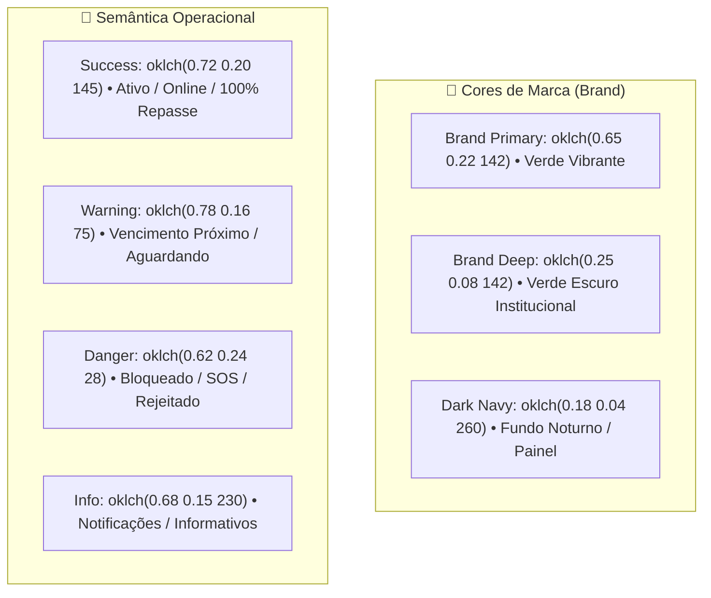

# 03. Design System e Identidade Visual

---

## 1. Princípios de Design e Filosofia Visual

O Design System do **PARTIU MOBE** foi concebido sob três pilares fundamentais:
1. **Ergonomia Operacional:** O aplicativo do motorista é utilizado em suportes automotivos sob forte luz solar ou durante a noite. Os contrastes, botões de toque e fontes foram calculados para máxima legibilidade sem distrações ao volante.
2. **Minimalismo Funcional (Redução de Carga Cognitiva):** O painel administrativo e os aplicativos apresentam apenas as informações necessárias para a tomada de decisão no momento certo, eliminando poluição visual, tabelas truncadas e excessos de métricas irrelevantes.
3. **Consistência em Múltiplas Plataformas:** Todos os tokens de design (espaçamento, cores, raios e sombras) obedecem às mesmas variáveis CSS semânticas estruturadas no Tailwind v4.

---

## 2. Paleta de Cores e Tokens Visuais

O projeto adota o espaço de cores perceptualmente uniforme **oklch**, proporcionando gradientes sem perda de vibração e contrastes consistentes entre os modos Claro e Escuro.

### A. Tabela de Tokens de Cores do Sistema

| Token CSS | Variável Tailwind | Amostra Visual / Uso Principal | Modo Claro (`:root`) | Modo Escuro (`.dark`) |
| :--- | :--- | :--- | :--- | :--- |
| `--primary` | `bg-primary` / `text-primary` | Ação principal, CTAs, botões | Verde Partiu Vibrante | Verde Neon Equilibrado |
| `--primary-deep` | `bg-primary-deep` | Headers executivos, cabeçalhos | Verde Floresta Profundo | Verde Floresta Escuro |
| `--background` | `bg-background` | Fundo geral da aplicação | `oklch(0.985 0.002 247)` | `oklch(0.14 0.02 260)` |
| `--surface` | `bg-surface` | Cards, modais e superfícies | `oklch(1 0 0)` (Branco Puro) | `oklch(0.18 0.03 260)` (Grafite) |
| `--border` | `border-border` | Divisórias e bordas sutis | `oklch(0.91 0.01 247)` | `oklch(0.28 0.03 260)` |
| `--success` | `bg-success` / `text-success` | Status Ativo, 0% Taxa, Pix Pago | `oklch(0.72 0.20 145)` | `oklch(0.75 0.22 145)` |
| `--warning` | `bg-warning` / `text-warning` | Tolerância, Carência, Trial | `oklch(0.78 0.16 75)` | `oklch(0.80 0.18 75)` |
| `--destructive` | `bg-destructive` | Bloqueado, SOS, Cancelamento | `oklch(0.62 0.24 28)` | `oklch(0.65 0.26 28)` |

---

## 3. Tipografia e Escala de Tipos

A família tipográfica oficial é a **Inter** (com fallback nativo para `system-ui, -apple-system, BlinkMacSystemFont, 'Segoe UI', Roboto, sans-serif`).

| Nível Hierárquico | Classe Tailwind | Tamanho / Line-Height | Peso da Fonte | Aplicação Recomendada |
| :--- | :--- | :--- | :--- | :--- |
| **Display Grande** | `text-3xl` ou `text-4xl` | 30px a 36px / 1.2 | Black (900) ou ExtraBold (800) | Títulos de Dashboards, Valores de MRR |
| **Título H1** | `text-2xl` | 24px / 1.3 | Bold (700) ou ExtraBold (800) | Título de Telas e Modais |
| **Título H2** | `text-xl` | 20px / 1.35 | Bold (700) | Cabeçalho de Cards e Seções |
| **Subtítulo** | `text-lg` | 18px / 1.4 | SemiBold (600) | Nome de Planos, Grupos de Inputs |
| **Corpo (Body)** | `text-sm` ou `text-base` | 14px a 16px / 1.5 | Medium (500) ou Regular (400) | Textos descritivos, instruções, dados |
| **Legenda / Tag** | `text-xs` ou `text-[11px]` | 11px a 12px / 1.4 | Bold (700) ou Black (900) | Badges de Status, Pílulas, Timestamps |

---

## 4. Grid Espacial de 8pt e Raios de Curvatura

### A. Escala de Espaçamento Base 8pt
Todos os espaçamentos (paddings, margins e gaps) seguem rigorosamente a progressão harmônica de 4pt e 8pt:
- `4px` (`gap-1` / `p-1`) — Micro-espaçamentos entre ícone e texto.
- `8px` (`gap-2` / `p-2`) — Espaçamento padrão entre tags e badges.
- `12px` (`gap-3` / `p-3`) — Densidade compacta para listas móveis.
- `16px` (`gap-4` / `p-4`) — Espaçamento interno padrão de cards.
- `24px` (`gap-6` / `p-6`) — Divisão entre seções e painéis.
- `32px` (`gap-8` / `p-8`) — Margens externas em telas desktop.

### B. Tokens de Arredondamento (Border Radius)
- `--radius-sm (4px):` Badges minúsculos e checkboxes.
- `--radius-md (8px):` Inputs de formulário, botões secundários.
- `--radius-lg (12px):` Botões de ação rápida, cards menores.
- `--radius-xl (16px):` Cards principais e seções de painel.
- `--radius-2xl (24px):` Modais, bottom sheets e caixas de diálogo.
- `--radius-3xl (32px):` Painéis flutuantes e gavetas do motorista.
- `rounded-full (9999px):` Avatares, pílulas de status e botões de áudio/voz.

---

## 5. Elevação, Sombras e Profundidade (Material 3)

As sombras do sistema criam sensação de relevo limpo sem escurecer excessivamente a interface:
- **`shadow-soft`:** `0 2px 8px -2px rgba(0, 0, 0, 0.05)` — Cards em repouso.
- **`shadow-card`:** `0 4px 16px -4px rgba(0, 0, 0, 0.08)` — Cards com interação / hover.
- **`shadow-elevated`:** `0 12px 32px -8px rgba(0, 0, 0, 0.16)` — Modais, menus dropdown e popovers.

---

## 6. Acessibilidade (WCAG 2.1 Nível AA)

1. **Áreas de Toque (Touch Targets):**  
   Todo elemento clicável no aplicativo do passageiro e motorista possui altura e largura mínima de **48x48dp**, garantindo acionamento seguro mesmo com trepidação do veículo ou uso de apenas uma mão.
2. **Razão de Contraste:**  
   Texto normal com contraste mínimo de **4.5:1** e texto grande/badges com contraste mínimo de **3.0:1** sobre qualquer superfície.
3. **Navegação por Teclado e Foco:**  
   No painel administrativo, todos os controles interativos possuem indicador de foco de alta visibilidade (`focus-visible:ring-2 focus-visible:ring-primary focus-visible:ring-offset-2`).
4. **Sem Dependência Exclusiva de Cor:**  
   Todo status crítico (ex: "Bloqueado por Inadimplência", "Assinatura Vencida", "SOS Ativo") exibe um **ícone representativo** juntamente com o texto explicativo, sem depender exclusivamente da cor para comunicar o estado.
