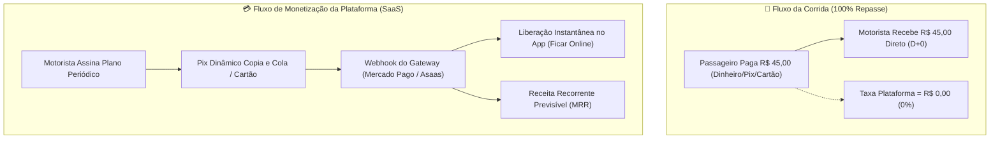
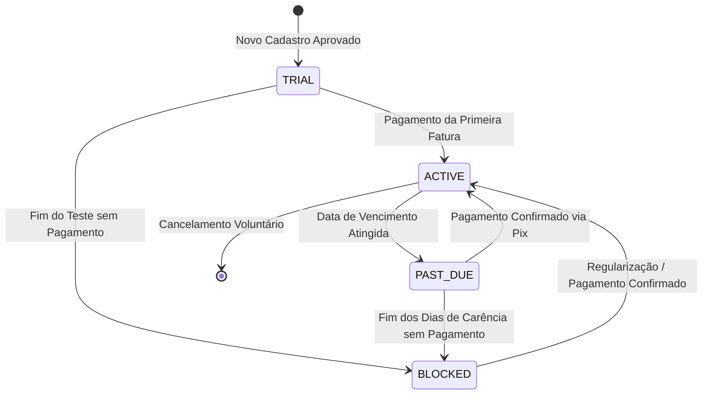

# 04. Modelo de Negócio e Estratégia de Monetização (SaaS Puro)

---

## 1. Diretriz Estratégica Fundamental (North Star)

O modelo de negócios do **PARTIU MOBE** foi estruturado em torno de uma premissa imutável:

> **TAXA ZERO POR CORRIDA (0% TAKE RATE):**  
> O motorista parceiro fica com **100% do valor bruto** de cada viagem realizada. A plataforma **NÃO retém comissões percentuais** nem desconta créditos fracionados a cada corrida concluída.

A monetização da plataforma decorre **exclusivamente de assinaturas de acesso (*Software as a Service - SaaS*)** pagas periodicamente pelos condutores cadastrados.



---

## 2. Catálogo Oficial de Planos de Assinatura

Os planos são parametrizáveis no Painel Administrativo (`/app/admin/monetizacao`) e contemplam diferentes perfis de trabalho (motoristas em tempo integral, condutores de fins de semana e iniciantes em teste):

| Identificador | Nome do Plano | Periodicidade | Preço Sugerido (BRL) | Dias de Carência | Dias de Teste (*Trial*) | Take Rate por Corrida |
| :--- | :--- | :--- | :--- | :--- | :--- | :--- |
| `plano_diario_24h` | **Diária Express (24h)** | Diário (1 dia) | R$ 12,00 | 0 dias | 0 dias | **0,0%** |
| `plano_semanal` | **Semanal Flex** | Semanal (7 dias) | R$ 45,00 | 1 dia | 0 dias | **0,0%** |
| `plano_mensal_pro` | **Mensal Pro (Recomendado)** | Mensal (30 dias) | R$ 149,90 | 3 dias | 7 dias (primeiro cadastro) | **0,0%** |
| `plano_trimestral` | **Trimestral Fidelidade** | Trimestral (90 dias) | R$ 389,00 | 5 dias | 0 dias | **0,0%** |
| `plano_anual_vip` | **Anual VIP Platinum** | Anual (365 dias) | R$ 1.290,00 | 7 dias | 0 dias | **0,0%** |

### Vantagens do Plano Diário (24h)
Permite que motoristas casuais (que dirigem apenas sextas ou sábados) trabalhem sem o compromisso de pagar a mensalidade cheia, maximizando a adesão e o volume de veículos disponíveis nos horários de pico.

---

## 3. Ciclo de Vida da Assinatura do Condutor

A conta de cada motorista transita por quatro estados finitos rigorosamente controlados pelo `DriverSubscriptionService`:



### Detalhamento dos Estados:

1. **`TRIAL` (Em Período de Teste Grátis):**
   - Concedido automaticamente na aprovação inicial do cadastro documental (geralmente 7 dias).
   - Motorista tem acesso pleno ao recebimento de chamados com 0% de comissão.
2. **`ACTIVE` (Assinatura Ativa e Regular):**
   - Mensalidade quitada e dentro do prazo de vigência (`validade_assinatura >= NOW()`).
   - Elegibilidade total na esteira de despacho geográfico.
3. **`PAST_DUE` (Vencida / Aguardando Pagamento em Período de Carência):**
   - Assinatura venceu, mas o condutor está dentro dos dias de tolerância/carência (ex: 3 dias).
   - No app, o motorista visualiza banner amarelo de aviso com botão de pagamento imediato, mas ainda pode realizar viagens durante a carência.
4. **`BLOCKED` (Bloqueada por Inadimplência):**
   - Carência expirou sem quitação da fatura.
   - O aplicativo exibe tela de bloqueio com chave Pix Copia e Cola. O botão "Ficar Online" é desativado.
   - O motor de despacho exclui o condutor imediatamente das buscas PostGIS.

---

## 4. Integração de Pagamentos Pix e Desbloqueio Instantâneo

A plataforma integra-se diretamente a gateways de pagamento autorizados pelo Banco Central (Mercado Pago, Asaas, PicPay e EFI Bank):

1. **Geração Dinâmica de Pix:**
   - Ao clicar em "Renovar Assinatura", o app solicita à Edge Function `/api/subscription/checkout-pix`.
   - Um payload Pix dinâmico com chave EMV e QR Code é retornado com tempo de expiração de 15 a 30 minutos.
2. **Confirmação via Webhook Seguro (HMAC-SHA256):**
   - O gateway envia notificação de pagamento para o endpoint `/api/webhooks/pix-subscription`.
   - O sistema valida a assinatura HMAC e o segredo do tenant.
3. **Ativação Reativa em Menos de 2 Segundos:**
   - A fatura transita para `paid`.
   - O campo `validade_assinatura` do motorista é estendido por `+X dias`.
   - O status é atualizado para `ACTIVE`.
   - Um evento via canal WebSocket do Supabase Realtime é emitido para o aplicativo do condutor, desbloqueando instantaneamente o botão "Ficar Online" na tela do motorista sem necessidade de recarregar a página.

---

## 5. Regra de Negócio no Motor de Despacho (Matching Engine)

A regra de ouro da monetização está embutida no algoritmo de busca de condutores no arquivo [`src/services/MatchingEngine.ts`](file:///c:/Users/Suporte/Desktop/NOVO%20PARTIU-MOBE/src/services/MatchingEngine.ts) e na view de proximidade do PostgreSQL:

```sql
-- Cláusula Mandatória de Despacho no PostgreSQL:
SELECT motorista_id, ST_Distance(geom, passageiro_geom) as distancia
FROM motoristas_ativos
WHERE documentos_aprovados = true
  AND status_operacional = 'ONLINE'
  AND status_assinatura IN ('ACTIVE', 'TRIAL')
  AND validade_assinatura >= NOW()
ORDER BY distancia ASC
LIMIT 10;
```

> **Garantia Arquitetural:** Motoristas inadimplentes ou com validade expirada sequer entram na fila de avaliação ou na onda de ofertas (*wave dispatch*). A integridade do modelo de negócio é garantida no nível de banco de dados e serviço.

---

## 6. Modelo de Franquias e Repasse de Royalties

Para praças operadas por parceiros regionais ou franqueados:
- **Repasse das Assinaturas:** O franqueado recebe entre **70% e 90%** do valor das assinaturas pagas pelos condutores de sua cidade.
- **Taxa de Tecnologia da Matriz:** A matriz da plataforma retém entre **10% e 30%** para custear servidores, infraestrutura em nuvem, mapas, suporte e melhorias de software.
- **Corridas 100% dos Condutores:** Nem a matriz nem o franqueado descontam qualquer percentual das corridas realizadas na cidade.

---

## 7. Métricas Executivas do Modelo SaaS (Painel de Gestão)

O Painel Administrativo monitora a saúde financeira do negócio através das seguintes métricas SaaS:

- **MRR (Monthly Recurring Revenue):** Faturamento mensal recorrente em assinaturas.
- **ARR (Annual Run Rate):** Projeção de faturamento anual (`MRR * 12`).
- **LTV (Lifetime Value):** Tempo médio de permanência do motorista multiplicado pela mensalidade média.
- **CAC (Customer Acquisition Cost):** Custo de marketing/indicação por novo motorista ativo.
- **Taxa de Churn:** Percentual de motoristas que cancelaram ou deixaram de renovar no período.
- **GMV Total Transacionado:** Volume bruto movimentado pelos motoristas (métrica de impacto econômico mostrando quanto os motoristas faturaram livre de taxas abusivas).
