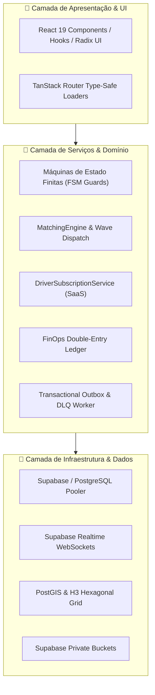
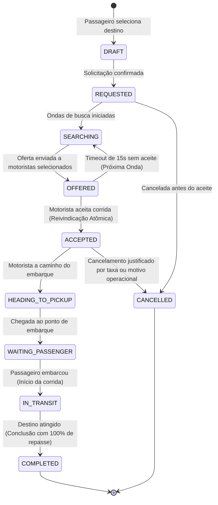
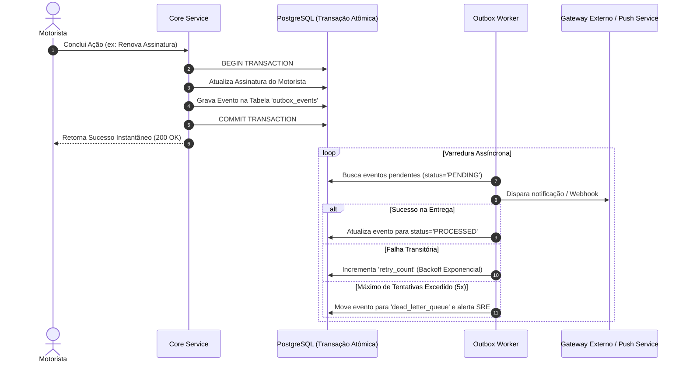

# 05. Arquitetura de Software e Engenharia de Sistemas

---

## 1. Visão Geral dos Padrões Arquiteturais

A engenharia do **PARTIU MOBE** foi projetada para suportar missões críticas com tolerância a falhas, concorrência agressiva e integridade matemática absoluta. A estrutura segue os princípios de **Clean Architecture**, **Domain-Driven Design (DDD)** e padrões corporativos consolidados (*ByteByteGo 2025 Architecture Standards*).

---

## 2. Máquinas de Estado Finitas do Domínio (Finite State Machines - FSM)

Para prevenir transições inválidas, inconsistências de telas e race conditions concorrentes, os objetos centrais da aplicação são controlados por **máquinas de estados estritas com travas de guarda (*guards*)**:

### A. Máquina de Estados da Corrida (Ride FSM)
Controla o ciclo de vida completo de uma viagem entre passageiro e motorista:

*Invariante de Segurança:* Qualquer tentativa de transição fora da sequência (exemplo: transitar de `DRAFT` diretamente para `COMPLETED`) dispara erro em nível de serviço e no banco, abortando a transação.

### B. Máquina de Estados do Dispositivo do Motorista
Controla a autorização de aparelhos cadastrados para prevenir clonagem de contas e fraude de telemetria:
- `REGISTERED` (Cadastrado) $\to$ `PAIRED` (Pareado com CNH) $\to$ `ACTIVE` (Autorizado) $\to$ `REVOKED` (Revogado por Suspeita).
- *Regra Imutável:* Dispositivos com status `REVOKED` têm qualquer requisição de despacho ou telemetria rejeitada imediatamente com código `DEVICE_REVOKED`.

---

## 3. FinOps: Ledger Contábil de Dupla Entrada (Double-Entry Bookkeeping)

Todas as transações monetárias (pagamento de mensalidades, faturas SaaS, créditos institucionais e repasses de royalties para franquias) são registradas em uma tabela de **Ledger Imutável** com precisão em centavos inteiros (*minor units* — formato BigInt/Inteiro):

### Regras do Motor Contábil:
1. **Balanço Zero Inegociável:** Cada operação gera obrigatoriamente duas ou mais entradas contábeis balanceadas. A soma aritmética dos débitos deve ser exatamente igual à soma dos créditos:
   $$\sum \text{Débitos} \equiv \sum \text{Créditos}$$
2. **Proibição de UPDATE e DELETE:** O livro contábil é estritamente *Append-Only*. Erros ou estornos operacionais são tratados gerando um novo registro de contrapartida (estorno contábil rastreável com `idempotency_key`).
3. **Prevenção de Floating-Point Rounding:** Valores monetários nunca utilizam tipos de ponto flutuante (`float`, `double`) no JavaScript ou no SQL. R$ 149,90 é representado rigorosamente como o número inteiro `14990`.

---

## 4. Padrão Transactional Outbox e Dead-Letter Queue (DLQ)

Para garantir que notificações push, mensagens no WhatsApp, webhooks para franquias e eventos de telemetria nunca sejam perdidos em caso de falha transitória de rede, o sistema implementa o padrão **Transactional Outbox**:

---

## 5. Motor de Idempotência Global (Anti-Duplication Engine)

Para mitigar problemas de perda de conexão móvel onde o motorista ou passageiro clica repetidamente em um botão sob oscilação de 3G/4G, a API implementa o cabeçalho obrigatório:
`Idempotency-Key: <UUIDv4>`

- **Primeira Requisição:** Executa o processamento normalmente e armazena o hash criptográfico do payload de entrada e a resposta serializada na tabela `idempotency_records` por 24 horas.
- **Requisições Repetidas (com mesmo payload):** Retornam instantaneamente o resultado idêntico armazenado no cache do banco sem reexecutar lógica de negócio ou debitar pagamentos adicionais.
- **Requisições com Mesma Chave e Payload Diferente:** Rejeitadas com o código de erro `409 Conflict` (`IDEMPOTENCY_PAYLOAD_MISMATCH`).

---

## 6. Arquitetura Geoespacial e Despacho Concorrente (PostGIS + H3)

O motor de localização e matching foi construído para lidar com centenas de atualizações de GPS por segundo sem sobrecarregar o banco de dados:

### A. Deadband Geográfico e Throttle de Escrita
Em trânsito urbano, veículos parados em semáforos ou congestionamentos geram leituras de GPS repetitivas. O `DynamicGpsProfileManager` aplica as seguintes regras:
- **Veículo Parado (deslocamento < 20 metros e intervalo < 15 segundos):** O ponto GPS **NÃO** é persistido no banco de dados principal, evitando escritas inúteis de I/O de disco.
- **Veículo em Movimento (deslocamento $\ge$ 20 metros):** Ponto transmitido imediatamente via WebSocket Realtime e persistido em buffer.
- **Heartbeat Temporal de Liveness:** Se o veículo permanecer mais de 15 segundos sem se mover, transmite um batimento cardíaco leve para confirmar que o motorista continua online e conectado à rede.

### B. Despacho Concorrente em Ondas (*Wave Dispatch*)
Quando um passageiro solicita uma corrida:
1. O `MatchingEngine` identifica motoristas elegíveis num raio inicial de 1,5 km usando PostGIS `ST_DWithin`.
2. A corrida é ofertada à primeira onda com janela de contagem regressiva de 15 segundos.
3. **Prevenção de Race Condition:** O aceite do motorista é executado via **RPC Atômica no PostgreSQL** com bloqueio pessimista de linha (`SELECT FOR UPDATE`). Se 2 motoristas clicarem no mesmo milissegundo, exatamente um vence a disputa e o outro recebe notificação limpa de que a viagem já foi atendida, sem deadlocks.
