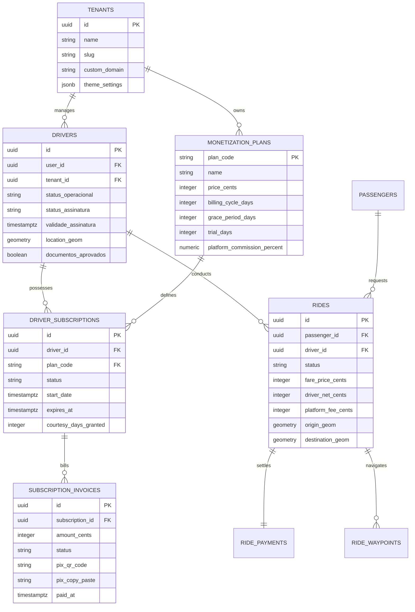

# 06. Banco de Dados e Schemas PostgreSQL / Supabase

---

## 1. Visão Geral da Modelagem de Dados

O banco de dados relacional do **PARTIU MOBE** é hospedado no **PostgreSQL 15+** gerenciado via Supabase Cloud, com a extensão espacial **PostGIS 3.3** habilitada. Toda a modelagem é orientada a integridade referencial estrita, garantias ACID, índices de alta performance e isolamento Multi-Tenant via **Row Level Security (RLS)**.



---

## 2. Tabelas Core do Modelo de Monetização SaaS

### A. Tabela `monetization_plans` (Catálogo de Planos)
Armazena a definição dos planos periódicos que os motoristas podem assinar:

```sql
CREATE TABLE IF NOT EXISTS public.monetization_plans (
    plan_code VARCHAR(64) PRIMARY KEY,
    name VARCHAR(128) NOT NULL,
    description TEXT,
    price_cents INTEGER NOT NULL CHECK (price_cents >= 0),
    billing_cycle_days INTEGER NOT NULL CHECK (billing_cycle_days > 0),
    grace_period_days INTEGER NOT NULL DEFAULT 0,
    trial_days INTEGER NOT NULL DEFAULT 0,
    platform_commission_percent NUMERIC(5,2) NOT NULL DEFAULT 0.00,
    is_active BOOLEAN NOT NULL DEFAULT true,
    created_at TIMESTAMPTZ NOT NULL DEFAULT timezone('utc'::text, now()),
    updated_at TIMESTAMPTZ NOT NULL DEFAULT timezone('utc'::text, now()),
    CONSTRAINT ck_monetization_plans_zero_take_rate CHECK (platform_commission_percent = 0.00)
);
```
> **Nota de Blindagem:** A constraint `ck_monetization_plans_zero_take_rate` impede fisicamente a inserção de qualquer taxa de comissão maior que 0.00% no catálogo de planos.

### B. Tabela `driver_subscriptions` (Vigência de Acesso do Motorista)
Registra o estado atual da assinatura de cada motorista:

```sql
CREATE TABLE IF NOT EXISTS public.driver_subscriptions (
    id UUID PRIMARY KEY DEFAULT gen_random_uuid(),
    driver_id UUID NOT NULL REFERENCES public.drivers(id) ON DELETE CASCADE,
    plan_code VARCHAR(64) NOT NULL REFERENCES public.monetization_plans(plan_code),
    status VARCHAR(32) NOT NULL DEFAULT 'trial' 
        CHECK (status IN ('trial', 'active', 'past_due', 'blocked', 'cancelled')),
    start_date TIMESTAMPTZ NOT NULL DEFAULT timezone('utc'::text, now()),
    expires_at TIMESTAMPTZ NOT NULL,
    courtesy_days_granted INTEGER NOT NULL DEFAULT 0,
    blocked_reason TEXT,
    created_at TIMESTAMPTZ NOT NULL DEFAULT timezone('utc'::text, now()),
    updated_at TIMESTAMPTZ NOT NULL DEFAULT timezone('utc'::text, now())
);

CREATE INDEX IF NOT EXISTS idx_driver_subs_driver_status 
    ON public.driver_subscriptions(driver_id, status);
CREATE INDEX IF NOT EXISTS idx_driver_subs_expires 
    ON public.driver_subscriptions(expires_at);
```

### C. Tabela `subscription_invoices` (Faturas Pix)
Guarda o histórico de cobrança e identificação do Pix dinâmico:

```sql
CREATE TABLE IF NOT EXISTS public.subscription_invoices (
    id UUID PRIMARY KEY DEFAULT gen_random_uuid(),
    subscription_id UUID NOT NULL REFERENCES public.driver_subscriptions(id) ON DELETE CASCADE,
    driver_id UUID NOT NULL REFERENCES public.drivers(id) ON DELETE CASCADE,
    amount_cents INTEGER NOT NULL CHECK (amount_cents > 0),
    status VARCHAR(32) NOT NULL DEFAULT 'pending' 
        CHECK (status IN ('pending', 'paid', 'expired', 'cancelled', 'refunded')),
    gateway_provider VARCHAR(32) NOT NULL DEFAULT 'mercadopago',
    gateway_transaction_id VARCHAR(128),
    pix_qr_code TEXT,
    pix_copy_paste TEXT,
    expires_at TIMESTAMPTZ NOT NULL,
    paid_at TIMESTAMPTZ,
    created_at TIMESTAMPTZ NOT NULL DEFAULT timezone('utc'::text, now())
);
```

---

## 3. Tabela de Corridas (`rides`) e Trigger Defensiva de 0% Taxa

A tabela de corridas garante a integridade financeira de 100% repasse líquido ao motorista:

```sql
CREATE TABLE IF NOT EXISTS public.rides (
    id UUID PRIMARY KEY DEFAULT gen_random_uuid(),
    tenant_id UUID NOT NULL REFERENCES public.tenants(id),
    passenger_id UUID NOT NULL REFERENCES public.profiles(id),
    driver_id UUID REFERENCES public.drivers(id),
    category_id VARCHAR(32) NOT NULL DEFAULT 'economico',
    status VARCHAR(32) NOT NULL DEFAULT 'DRAFT'
        CHECK (status IN ('DRAFT', 'REQUESTED', 'OFFERED', 'ACCEPTED', 
                          'HEADING_TO_PICKUP', 'WAITING_PASSENGER', 
                          'IN_TRANSIT', 'COMPLETED', 'CANCELLED')),
    origin_address TEXT NOT NULL,
    origin_geom GEOMETRY(Point, 4326) NOT NULL,
    destination_address TEXT NOT NULL,
    destination_geom GEOMETRY(Point, 4326) NOT NULL,
    distance_meters INTEGER NOT NULL,
    duration_seconds INTEGER NOT NULL,
    fare_price_cents INTEGER NOT NULL,
    driver_net_cents INTEGER NOT NULL,
    platform_fee_cents INTEGER NOT NULL DEFAULT 0,
    payment_method VARCHAR(32) NOT NULL DEFAULT 'direct_pix_driver',
    created_at TIMESTAMPTZ NOT NULL DEFAULT timezone('utc'::text, now()),
    updated_at TIMESTAMPTZ NOT NULL DEFAULT timezone('utc'::text, now()),
    CONSTRAINT ck_rides_zero_platform_fee CHECK (platform_fee_cents = 0)
);

-- Trigger de Auditoria e Garantia de 100% Repasse Líquido:
CREATE OR REPLACE FUNCTION public.fn_enforce_zero_commission_ride()
RETURNS TRIGGER AS $$
BEGIN
    NEW.platform_fee_cents := 0;
    NEW.driver_net_cents := NEW.fare_price_cents;
    RETURN NEW;
END;
$$ LANGUAGE plpgsql;

CREATE TRIGGER trg_rides_zero_commission
    BEFORE INSERT OR UPDATE ON public.rides
    FOR EACH ROW
    EXECUTE FUNCTION public.fn_enforce_zero_commission_ride();
```

---

## 4. Índices Espaciais PostGIS e Otimização de Busca

Para viabilizar pesquisas de proximidade geográfica submétricas em cidades densas:

```sql
-- Índice GIST de Alta Velocidade para Posição Atual dos Motoristas:
CREATE INDEX IF NOT EXISTS idx_drivers_spatial_location
    ON public.drivers USING GIST (location_geom)
    WHERE status_operacional = 'ONLINE' 
      AND status_assinatura IN ('active', 'trial');

-- View Otimizada para Despacho Instantâneo de Corridas:
CREATE OR REPLACE VIEW public.vw_nearby_eligible_drivers AS
SELECT 
    d.id AS driver_id,
    d.tenant_id,
    d.user_id,
    d.location_geom,
    d.status_assinatura,
    d.validade_assinatura,
    p.full_name,
    p.phone_number,
    p.avatar_url
FROM public.drivers d
JOIN public.profiles p ON p.id = d.user_id
WHERE d.documentos_aprovados = true
  AND d.status_operacional = 'ONLINE'
  AND d.status_assinatura IN ('active', 'trial')
  AND d.validade_assinatura >= timezone('utc'::text, now());
```

---

## 5. Políticas de Segurança (Row Level Security - RLS)

Todas as tabelas do ecossistema possuem `ALTER TABLE ... ENABLE ROW LEVEL SECURITY;`.

### Exemplo de RLS em `rides`:
```sql
-- 1. Passageiros podem ler suas próprias solicitações de corrida
CREATE POLICY "passengers_select_own_rides"
    ON public.rides FOR SELECT
    TO authenticated
    USING (passenger_id = auth.uid());

-- 2. Motoristas podem visualizar corridas a eles atribuídas
CREATE POLICY "drivers_select_assigned_rides"
    ON public.rides FOR SELECT
    TO authenticated
    USING (driver_id IN (SELECT id FROM public.drivers WHERE user_id = auth.uid()));

-- 3. Administradores da franquia têm visibilidade restrita ao seu tenant_id
CREATE POLICY "admin_select_tenant_rides"
    ON public.rides FOR ALL
    TO authenticated
    USING (
        EXISTS (
            SELECT 1 FROM public.admin_users au 
            WHERE au.user_id = auth.uid() 
              AND (au.is_super_admin = true OR au.tenant_id = rides.tenant_id)
        )
    );
```
