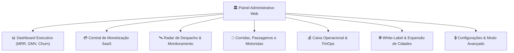
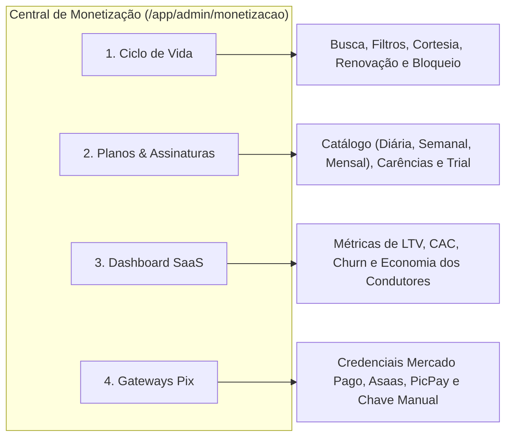

# 08. Módulo do Painel Administrativo Web

---

## 1. Visão Geral e Arquitetura de Informação

O **Painel Administrativo do PARTIU MOBE** é uma interface de gestão executiva de nível corporativo voltada para Super Administradores da holding, franqueados regionais e operadores de tráfego.

A experiência do usuário foi completamente redesenhada para eliminar sobrecarga cognitiva, tabelas truncadas e complexidade desnecessária. O painel adota:
- **Navegação Ergonômica:** Menu lateral retrátil e barra superior com status da frota em tempo real.
- **Paleta de Comandos Global (`Ctrl + K` / `Cmd + K`):** Permite localizar instantaneamente motoristas, passageiros, praças ou atalhos de configuração sem navegar manualmente pelos menus.
- **Microinterações e Estados de Vazio Acionáveis (*Empty States*):** Todas as tabelas vazias apresentam orientações claras e botões de ação para guiar o operador.

---

## 2. Telas e Módulos Principais

### A. Dashboard Executivo SaaS (`/app/admin/index`)
Substituiu os antigos gráficos de retenção de comissão por um painel focado na saúde financeira do modelo de recorrência:
- **Card 1: MRR (Monthly Recurring Revenue):** Faturamento líquido consolidado de mensalidades no mês corrente.
- **Card 2: Motoristas Assinantes Ativos:** Total de condutores com assinatura em dia aptos a rodar.
- **Card 3: Assinaturas a Vencer (Próximos 7 Dias):** Alerta preventivo de renovação para a equipe de sucesso do parceiro.
- **Card 4: Bloqueados por Inadimplência:** Total de motoristas com carência expirada que necessitam de contato ou regularização.
- **Card 5: Volume Transacionado (GMV Total):** Métrica de impacto social exibindo o valor total que os motoristas faturaram no período sem descontos da plataforma.

---

### B. Central de Monetização e Assinaturas (`/app/admin/monetizacao`)
A central de controle de receita é dividida em **quatro abas intuitivas**:

1. **Aba "Ciclo de Vida":**
   - Tabela unificada com pesquisa em tempo real por nome, placa ou telefone.
   - Filtros rápidos de status: `Todas`, `Ativas`, `Em Teste (Trial)`, `Vencidas / Carência` e `Bloqueadas`.
   - **Ações Imediatas por Motorista:**
     - *Conceder Dias de Cortesia:* Bonificação de 3 a 30 dias em caso de campanhas ou suporte.
     - *Renovar Manualmente:* Ativação com comprovante bancário físico.
     - *Bloquear Acesso:* Suspensão cautelar por conduta ou falta grave.
     - *Gerar Cobrança Pix:* Modal instantâneo gerando QR Code Pix para envio via WhatsApp ao motorista.
2. **Aba "Planos & Assinaturas":**
   - Criação e edição dos planos de acesso com parametrização de preço, periodicidade e dias de carência.
   - Tag permanente: `Taxa por Corrida: 0,00% (Garantido)`.
3. **Aba "Dashboard SaaS":**
   - Gráficos de retenção de motoristas, LTV, taxa de cancelamento voluntário (*churn*) e cálculo de economia média por motorista comparado a Uber/99.
4. **Aba "Gateways Pix":**
   - Configuração de chaves de API, webhooks e modos de operação (Produção vs Homologação).

---

### C. Radar de Despacho e Monitoramento em Tempo Real (`/app/admin/despacho`)
- **Mapa Vetorial com Telemetria Ativa:** Exibição em tempo real de todos os veículos online em movimento ou parados na malha urbana.
- **Fila de Corridas Pendentes:** Monitoramento do tempo de espera dos passageiros e contagem de ondas de busca (*wave dispatch*).
- **Intervenção Manual de Despacho:** O operador pode, em caráter excepcional, despachar manualmente uma corrida para um condutor específico caso a rede celular do passageiro apresente instabilidade.

---

### D. Caixa Operacional e FinOps (`/app/admin/caixa`)
- Conciliação bancária entre os pagamentos de mensalidades recebidos via Pix e os custos de infraestrutura da operação.
- Auditoria do Ledger de dupla entrada, atestando o balanço contábil diário.

---

### E. Gestão de Cidades e White-Label (`/app/admin/configuracoes` e `/app/admin/whitelabel`)
- **Wizard de Onboarding de Cidades (4 Passos):**
  1. *Dados da Cidade:* Nome, UF, polígono geográfico e coordenadas centrais.
  2. *Identidade Visual da Praça:* Cores primárias da marca local e nome fantasia do app.
  3. *Tarifas da Cidade & Repasse SaaS:* Tarifa base por km/minuto para os passageiros e percentual de repasse das mensalidades para a franquia local (com taxa 0% por corrida fixa).
  4. *Revisão & Ativação:* Verificação de integridade e ativação da praça na rede nacional.

---

### F. Modo Avançado com Proteção por Confirmação
Para evitar incidentes de indisponibilidade decorrentes de erros humanos:
- A aba de configurações de infraestrutura (chaves secretas do Supabase, URLs de Webhook, DNS e certificados) é protegida por **tela de confirmação explícita**.
- Modificações nesta área exigem digitação de código de segurança e geram logs imutáveis de auditoria com IP e timestamp.
