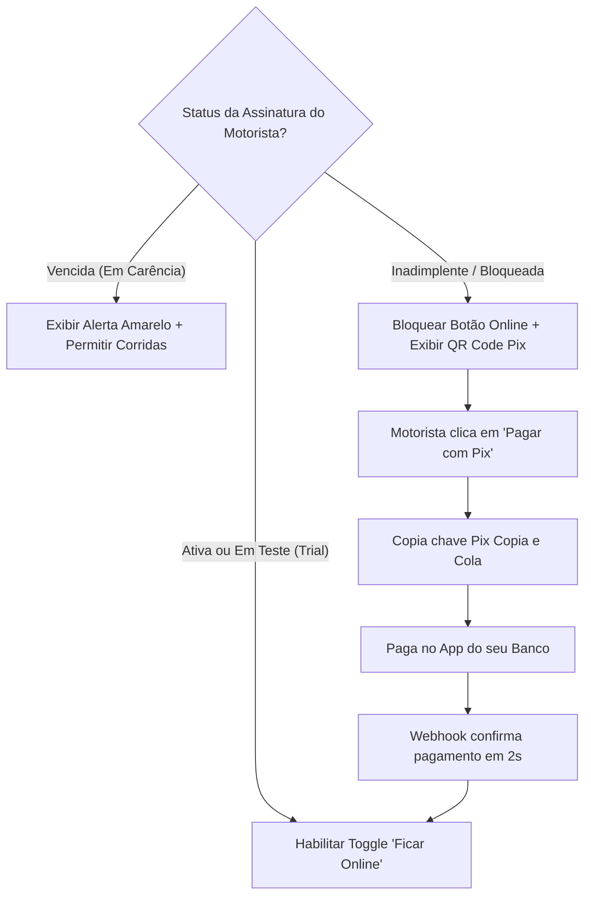

# 09. Módulos Mobile: Aplicativo do Passageiro e do Motorista

---

## 1. Visão Geral das Aplicações Mobile

As interfaces móveis do **PARTIU MOBE** foram desenvolvidas como **Progressive Web Apps (PWA) de Nova Geração**, combinando a velocidade e facilidade de distribuição da web com os recursos nativos dos sistemas Android e iOS (geolocalização em segundo plano, áudio contínuo de vigília, notificações push e instalação na tela inicial sem necessidade obrigatória de loja de aplicativos).

```mermaid
graph TD
    subgraph AppPassageiro ["🙋 App do Passageiro (/app/index)"]
        P1["1. Busca de Destino & Geocoding"]
        P2["2. Seleção de Categoria & Tarifa Estimada"]
        P3["3. Despacho & Rastreamento em Tempo Real"]
        P4["4. Pagamento Direto ao Motorista (D+0)"]
        P5["5. Avaliação Mútua & Histórico"]
        P1 --> P2 --> P3 --> P4 --> P5
    end

    subgraph AppMotorista ["🚗 App do Motorista (/app/motorista)"]
        M1["1. Cadastro Documental & Aprovação"]
        M2["2. Contratação de Plano SaaS (Pix Instantâneo)"]
        M3["3. Toggle 'Ficar Online' (Trava de Elegibilidade)"]
        M4["4. Alerta de Oferta (Ringing 15s)"]
        M5["5. Navegação & Ciclo da Corrida"]
        M6["6. Extrato de Ganhos 100% Líquidos (Taxa Zero)"]
        M1 --> M2 --> M3 --> M4 --> M5 --> M6
    end
```

---

## 2. Experiência e Jornada do Passageiro

### A. Solicitação e Estimativa Transparente
1. **Busca Preditiva de Endereços:**  
   Integração com Geocoding otimizado com cache local de destinos favoritos (Casa, Trabalho, Aeroporto).
2. **Seleção de Categorias de Transporte:**
   - **PARTIU Econômico:** Veículos compactos para o dia a dia.
   - **PARTIU Conforto:** Veículos sedãs ou com ar-condicionado obrigatório e porta-malas espaçoso.
   - **PARTIU Encomendas (Logística Urbana):** Envio de documentos e pequenos pacotes com **Código PIN Duplo** de segurança (PIN de coleta e PIN de entrega).
3. **Cálculo de Preço Sem Surpresas:**  
   O passageiro visualiza o valor fechado antes de confirmar a corrida, calculado com base na distância da rota OSRM/Mapbox e tempo estimado de tráfego.

### B. Rastreamento e Comunicação em Tempo Real
- **Movimentação Suave do Veículo no Mapa:** Posição do motorista interpolada via WebSocket, evitando saltos bruscos na tela.
- **Identificação do Condutor:** Nome, foto de perfil, modelo do carro, cor, placa e nota de avaliação média.
- **Chat Integrado:** Mensagens de texto em tempo real entre passageiro e motorista sem expor o número pessoal de telefone.

### C. Pagamento Direto e Conclusão
- **Formas de Pagamento:**
  - *Pix Direto ao Motorista:* O app exibe a chave Pix do condutor na tela de encerramento da viagem.
  - *Dinheiro Físico:* Pagamento em espécie diretamente ao condutor.
  - *Cartão de Débito/Crédito:* Pagamento na maquininha do próprio motorista dentro do carro.
- **Taxa da Plataforma:** O passageiro tem a certeza de que cada centavo pago remunera integralmente o profissional que o atendeu.

---

## 3. Experiência e Jornada do Motorista Parceiro

### A. Validação Documental e Onboarding
- Upload de fotos nítidas da CNH (com anotação "Exerce Atividade Remunerada - EAR"), CRLV do veículo atualizado e comprovante de residência.
- Análise de segurança na central administrativa com aprovação célere.

---

### B. Gestão da Assinatura SaaS e Regularização no App
O motorista conta com uma central financeira limpa e sem complicação integrada ao aplicativo:

- **Transparência de Valores:** Os planos (Diário, Semanal ou Mensal) são apresentados com destaque para a garantia de **100% de repasse de todas as corridas**.
- **Autonomia Total:** Sem contratos de fidelidade compulsória; o condutor pode pagar uma diária apenas nos dias em que decidir rodar.

---

### C. O Ciclo da Corrida para o Condutor

1. **Recepção da Oferta (Ringing & Alerta Sonoro):**
   - Ao receber uma chamada próxima, o app emite aviso sonoro e vibratório persistente.
   - Um card de alta legibilidade exibe: **Valor Líquido da Corrida**, **Distância até o Passageiro**, **Endereço de Embarque** e **Destino Final**.
   - Barra de contagem regressiva de 15 segundos para tomada de decisão.
2. **Navegação Assistida:**
   - Botão de abertura em um toque no **Google Maps** ou **Waze** com as coordenadas exatas da rota.
3. **Botão de Emergência SOS:**
   - Acionamento imediato com envio silencioso da localização em tempo real para a central de monitoramento e contatos de emergência cadastrados.
4. **Painel de Ganhos Sem Descontos:**
   - O extrato do condutor mostra apenas somas positivas: o total faturado é exatamente igual ao valor recebido, sem cards enganosos de "Taxa da Plataforma" ou retenções percentuais.
