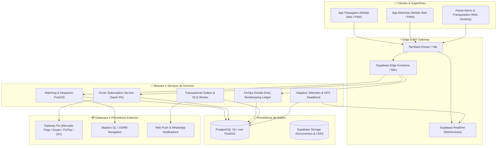

# 📚 PARTIU MOBE — Documentação Técnica & Arquitetural do Ecossistema

> **Versão:** 4.2 Enterprise SaaS  
> **Status:** Produção Homologada & 100% Testada (315/315 Testes Automatizados Aprovados)  
> **Modelo de Negócio:** SaaS Puro com Taxa Zero por Corrida (0% Take Rate)

---

## 📌 Sumário Executivo

O **PARTIU MOBE** é uma plataforma corporativa e resiliente de mobilidade urbana sob demanda e logística fracionada, desenvolvida com tecnologia de ponta para atender cidades médias, grandes polos urbanos e operações franqueadas (*White-Label*).

Diferente das plataformas legadas de transporte por aplicativo (como Uber e 99, que retêm entre 20% e 40% do valor bruto de cada corrida), o ecossistema PARTIU opera sob o modelo **SaaS Puro com Taxa Zero (0% Take Rate)**:
1. **O motorista parceiro retém 100% do valor bruto das viagens**, recebendo os pagamentos diretamente dos passageiros de forma líquida e imediata (D+0).
2. **A plataforma e os operadores locais monetizam exclusivamente via assinaturas periódicas** (Planos Diário 24h, Semanal, Mensal Pro, Trimestral ou Anual VIP) contratadas pelos motoristas para manter o direito de receber chamados no aplicativo.
3. **O motor de despacho e matching geográfico (PostGIS)** condiciona estritamente a distribuição de viagens aos condutores com documentos aprovados e assinatura ativa no sistema.

---

## 📂 Mapa da Documentação

A documentação está modularizada nos seguintes guias técnicos detalhados:

| Arquivo | Título | Conteúdo Principal |
| :--- | :--- | :--- |
| [01_VISAO_GERAL_E_ECOSSISTEMA.md](./01_VISAO_GERAL_E_ECOSSISTEMA.md) | **Visão Geral e Ecossistema** | Proposta de valor, diferenciais competitivos, atores da plataforma, governança de praças e jornadas do usuário. |
| [02_STACK_TECNOLOGICA_E_INFRAESTRUTURA.md](./02_STACK_TECNOLOGICA_E_INFRAESTRUTURA.md) | **Stack Tecnológica e Infraestrutura** | Arquitetura de frontend (React 19, Vite, Tailwind v4), backend Supabase / Node.js, GIS PostGIS, Realtime e segurança. |
| [03_DESIGN_SYSTEM_E_IDENTIDADE_VISUAL.md](./03_DESIGN_SYSTEM_E_IDENTIDADE_VISUAL.md) | **Design System e Identidade Visual** | Tokens visuais, paleta de cores (Brand, Neutros, Semânticos), tipografia, grid de 8pt, elevações M3 e regras de acessibilidade WCAG. |
| [04_MODELO_DE_NEGOCIO_E_MONETIZACAO.md](./04_MODELO_DE_NEGOCIO_E_MONETIZACAO.md) | **Modelo de Negócio e Monetização** | Regra North Star (0% take rate), catálogo de planos de assinatura, ciclo de vida, gateway Pix automático, trava de matching e split de franquias. |
| [05_ARQUITETURA_DE_SOFTWARE_E_ENGENHARIA.md](./05_ARQUITETURA_DE_SOFTWARE_E_ENGENHARIA.md) | **Arquitetura de Software e Engenharia** | Máquinas de estado finitas (FSMs), Ledger contábil de dupla entrada, Transactional Outbox, Idempotência e Telemetria com Deadband. |
| [06_BANCO_DE_DADOS_E_SCHEMAS.md](./06_BANCO_DE_DADOS_E_SCHEMAS.md) | **Banco de Dados e Schemas PostgreSQL** | DDL das tabelas principais, índices geoespaciais PostGIS, políticas de Row Level Security (RLS) e triggers defensivas. |
| [07_CONTRATOS_DE_API_E_INTEGRACOES.md](./07_CONTRATOS_DE_API_E_INTEGRACOES.md) | **Contratos de API e Integrações** | Endpoints REST, Edge Functions, RPCs PostgreSQL, canais Supabase Realtime, Webhooks Pix (Mercado Pago, Asaas, PicPay) e payloads. |
| [08_MODULO_PAINEL_ADMINISTRATIVO.md](./08_MODULO_PAINEL_ADMINISTRATIVO.md) | **Painel Administrativo Web** | Telas executivas, Dashboard SaaS (MRR/ARR/Churn), Central de Monetização, Radar de Despacho, Caixa, White-Label e Modo Avançado. |
| [09_MODULOS_MOBILE_PASSAGEIRO_E_MOTORISTA.md](./09_MODULOS_MOBILE_PASSAGEIRO_E_MOTORISTA.md) | **Módulos Mobile (Passageiro e Motorista)** | Fluxo completo do app do passageiro (chamada, rastreio, pagamento) e do motorista (assinatura Pix, toggle online, aceite atômico e navegação). |
| [10_GUIA_DE_DESENVOLVIMENTO_DEPLOY_E_OPERACAO.md](./10_GUIA_DE_DESENVOLVIMENTO_DEPLOY_E_OPERACAO.md) | **Desenvolvimento, Testes, Deploy e Operação** | Execução local, suíte de 315 testes automatizados, variáveis de ambiente, deploy em produção, observabilidade e contingência. |

---

## 🏗️ Visão Geral da Arquitetura de Alto Nível

---

## 🎯 Pilares Estruturais do Ecossistema

1. **Taxa Zero Inegociável (0% Take Rate):**  
   O motorista é o verdadeiro protagonista do negócio. Cada corrida concluída rende 100% líquido para o bolso de quem dirigiu. A plataforma nunca cobra comissão percentual ou retém créditos fracionados por viagem.
2. **Receita Recorrente Previsível (SaaS):**  
   A saúde financeira da empresa baseia-se em MRR (Monthly Recurring Revenue), com planos de assinatura flexíveis e automação de cobrança via Pix com liberação instantânea em segundos.
3. **Engenharia Resiliente e Confiabilidade Extrema:**  
   Arquitetura inspirada em padrões corporativos *ByteByteGo*, possuindo 315 testes automatizados cobrindo condições adversas, race conditions de despacho, ledger de dupla entrada imutável e operação offline segura.
4. **Governança Multi-Tenant e Expansão White-Label:**  
   Suporte nativo a franquias municipais, operadores regionais e cooperativas, permitindo personalização de marca, cores, tarifação base municipal e repasse de royalties das assinaturas.
